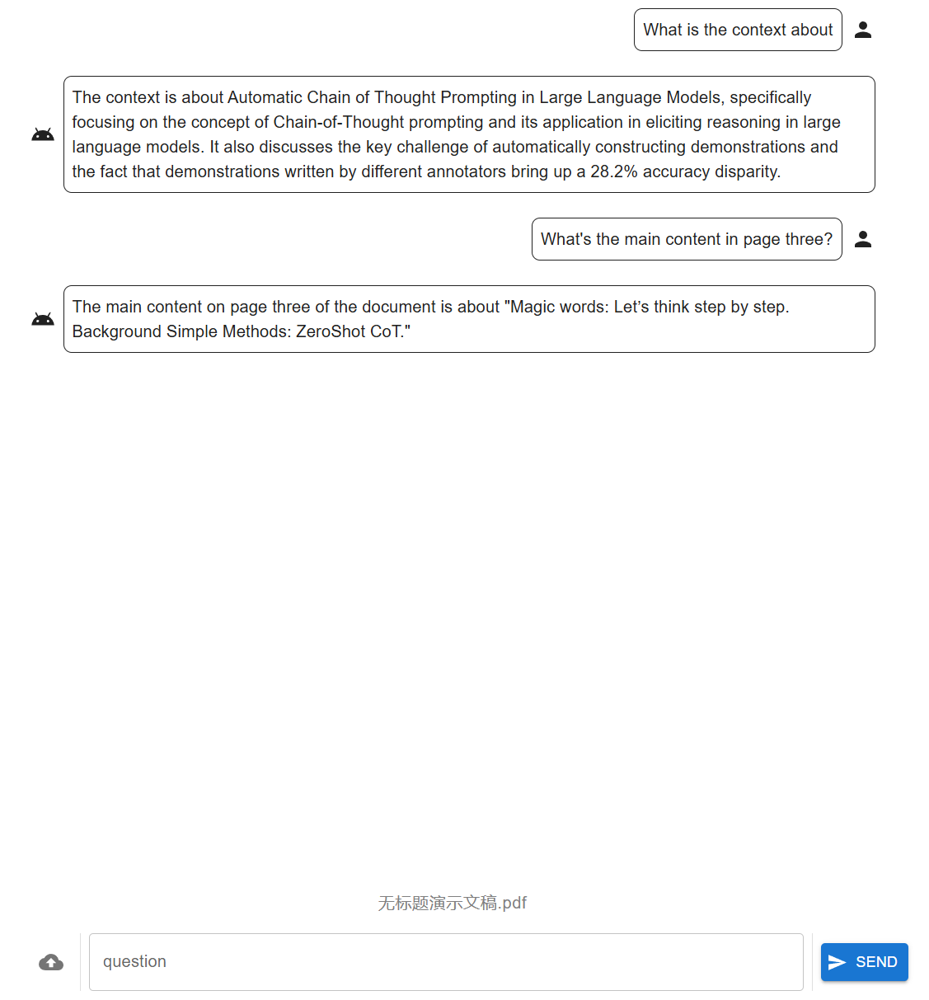

# pdf.llm

## About the Project

**pdf.llm** is a simple tool to communicate with your llm about your PDF.



## Installation

Configure your openai api key or baseurl. For example, export them on `.bashrc`

```sh
export OPENAI_API_KEY={YOUR_API_KEY}
export OPENAI_BASE_URL={BASE_URL} # optional
```

After cloning the repository, install the required libraries:

```sh
pip install -r requirements.txt
```

To lauch the frontend, install vite for development.

```sh
# in frontend
npm install
```

## Usage (Development Mode)

Run the application.

```sh
# in backend
flask run
```

```sh
# in frontend
npm run dev
```

Open the url shown in frontend terminal.
