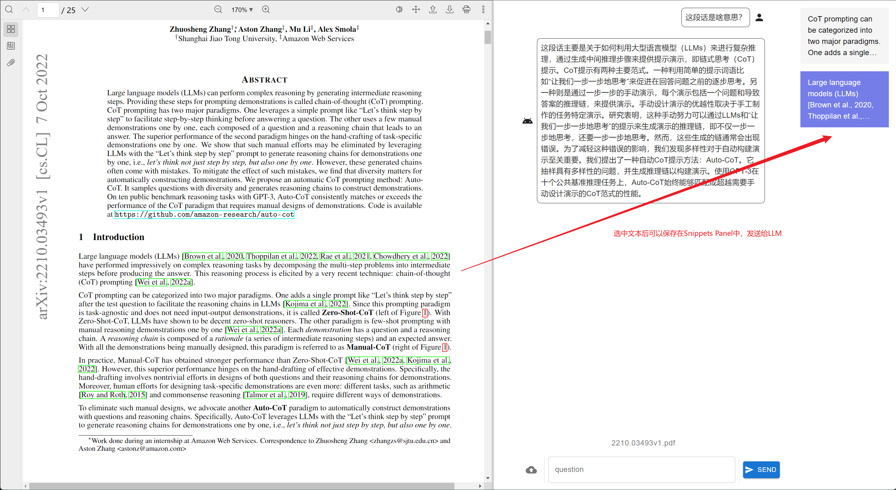

# pdf.llm

## About the Project

**pdf.llm** is a simple tool that allows you to interact with your LLM using PDF documents.



**Features**

1. Integrates a PDF Viewer with a ChatBot.
2. Offers additional context to the LLM based on the current page being viewed.
3. Allows selection and storage of snippets for easy reference during conversations with the LLM.

## LLM Environment

Before you begin, make sure to configure your OpenAI API key and, optionally the base URL

```sh
export OPENAI_API_KEY={YOUR_API_KEY}
export OPENAI_BASE_URL={BASE_URL} # optional
```

## Usage

### Run by Docker compose

Personally I recommend use Docker Compose to build and run the application. Ensure the docker and docker-compose is installed, run:

```sh
docker-compose up --build
```

Then visit `http://localhost:5173`.

Or you can build and run the frontend and backend independently.

### Run independently

I recommend you skip this section and check my [roadmap](#roadmap).

After cloning the repository, create a virutal environment with Python 3.12. In `backend` directory, install the required dependencies by running:

```sh
pip install -r requirements.txt
```

#### Frontend Setup

To lauch the frontend, ensure that Node.js is installed. Then navigate to `frontend` directory and run:

```sh
# in frontend
npm install
```

#### Usage (Development Mode)

1. Start the backend:

    ```sh
    # in backend
    flask run
    ```

2. Start the frontend:

    ```sh
    # in frontend
    npm run dev
    ```

Then, open the URL displayed in the frontend terminal.

## Roadmap

Currently, in version `v0.1.0`, pdf.llm is functional but not very user-friendly. In version `v0.2`, I plan to implement the following improvements:

### Features

* (Important) An enhanced cursor-like UI for better user interaction.
* (Important) Improved RAG performance.
  * Currently the frontend give page number and snippets to LLM, but it works in a trivial way and not been optimized.
* A streaming API for chat interactions.
* Config menu for setting api key, base url, and more.
* History persistence and session management.

### Bug fix

Not really a bug. Currenly the pdf load, split, and some other stuff will be done in the query of first question, so the first question is always slow. We can fix this by loading it when file is uploaded.
