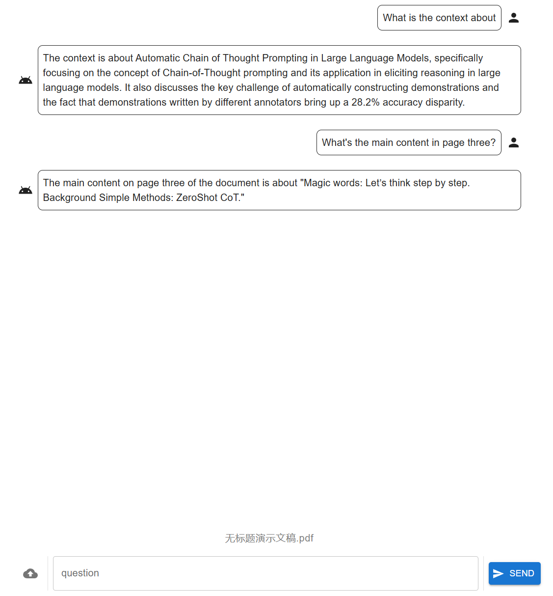

# pdf.llm

## About the Project

**pdf.llm** is a simple tool that allows you to interact with your LLM using PDF documents.



## OpenAI related

Before you begin, make sure to configure your OpenAI API key and, optionally the base URL

```sh
export OPENAI_API_KEY={YOUR_API_KEY}
export OPENAI_BASE_URL={BASE_URL} # optional
```

## Run by Docker compose

Personally I recommend use Docker Compose to build and run the application. Ensure the docker and docker-compose is installed, run:

```sh
docker-compose up --build
```

Then visit `http://localhost:5173`.

## Run independently

After cloning the repository, create a virutal environment with Python 3.12. In `backend` directory, install the required dependencies by running:

```sh
pip install -r requirements.txt
```

### Frontend Setup

To lauch the frontend, ensure that Node.js is installed. Then navigate to `frontend` directory and run:

```sh
# in frontend
npm install
```

## Usage (Development Mode)

1. Start the backend:

    ```sh
    # in backend
    flask run
    ```

2. Start the frontend:

    ```sh
    # in frontend
    npm run dev
    ```

Then, open the URL displayed in the frontend terminal.

## TODOs

* (Important) Cursor-like UI which enhance user experience and improve RAG performance.
* Stream api for chat interactions.
* History persistence and session management.
